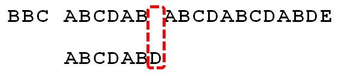
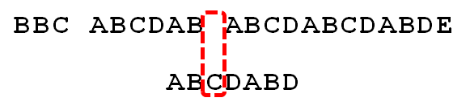
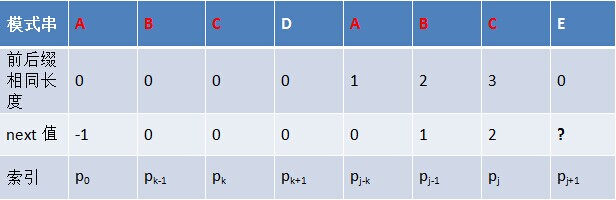
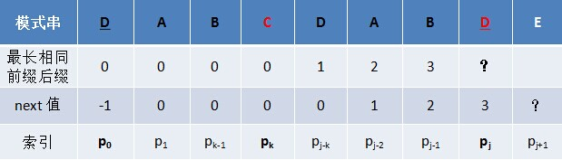
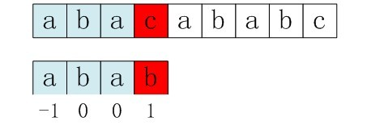
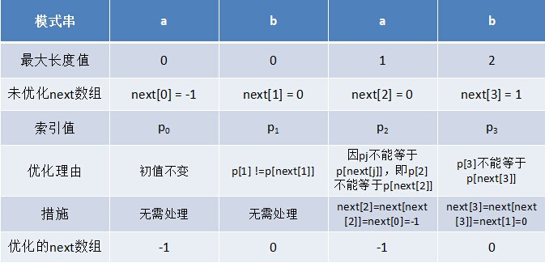

## 适用场景

有一个字符串s和一个模式串p，求p在s中的位置


## 暴力匹配算法

思路：

- 如果当前字符匹配成功（s[i] == p[j]），则继续匹配下一个字符（i++，j++）

- 如果匹配失败（s[i] != p[j]），则进行回溯，将j指向p的第一个位置，将i回溯至前一次匹配开始字符的下一个位置（i = i - (j - 1), j = 0）

```c++
int BF(string s, string p) {
    int slen = s.size();
    int plen = p.size();

    int i = 0, j = 0;
    while (i < slen && j < plen) {
        if (s[i] == p[j]) {
            i++;
            j++;
        } else {
            // 匹配失败，回溯
            i = i - j + 1;
            j = 0;
        }
    }
    if (j == plen)  return i - j;
    return -1;
}
```

  

## KMP算法

kmp算法关键在于不回溯i，每次失配只将j移动，而移动的位数和模式串的p[0, j - 1]子串有关，该子串的最大公共前后缀长度就是j回溯的位置。

以模式串p为`ABCDABD`，字符串s为`BBC ABCDAB ABCDABCDABDE`为例：

| 模式串的子串 | 前缀                       | 后缀                       | 公共前后缀长度 |
| ------------ | -------------------------- | -------------------------- | -------------- |
| A            | 无                         | 无                         | 0              |
| AB           | A                          | B                          | 0              |
| ABC          | A,AB                       | C,BC                       | 0              |
| ABCD         | A,AB,ABC                   | D,CD,BCD                   | 0              |
| ABCDA        | A,AB,ABC,ABCD              | A,DA,CDA,BCDA              | 1              |
| ABCDAB       | A,AB,ABC,ABCD,ABCDA        | B,AB,DAB,CDAB,BCDAB        | 2              |
| ABCDABD      | A,AB,ABC,ABCD,ABCDA,ABCDAB | D,BD,ABD,DABD,CDABD,BCDABD | 0               |

当字符串匹配到下图位置时，发生失配：



因为ABCDAB的公共最大前后缀长度为2，所以将j回溯到2，此时表示模式p的前两位已经匹配，从第3位开始下一次匹配，而i并不用回溯：



把公共前后缀的最大长度保存到一个next数组中：

| 模式串         | A   | B   | C   | D   | A   | B   | D   |
| -------------- | --- | --- | --- | --- | --- | --- | --- |
| 最大前后缀长度 | 0   | 0   | 0   | 0   | 1   | 2   | 0    |

但是因为j往前回溯的位数和模式串p[0, j-1]的子串的最大前后缀长度有关，所以要将next数组再整体向右移动一位，且第一位补-1，得到新的next数组：

| 模式串 | A   | B   | C   | D   | A   | B   | D   |
| ------ | --- | --- | --- | --- | --- | --- | --- |
| next   | -1  | 0   | 0   | 0   | 0   | 1   | 2   |

所以算法实现可以写成：

```c++
// next数组的代码求法在下文给出
int KMP(string s, string p) {
    int slen = s.size();
    int plen = p.size();

    int i = 0, j = 0;
    while (i < slen && j < plen) {
        if (j == -1 || s[i] == p[j]) {
            i++;
            j++;
        } else {
            // 匹配失败，只将j回溯
            j = next[j];
        }
    }
    if (j == plen)  return i - j;
    return -1;
}
```

### next数组的实现

假定值k有：p0p1....p(k-1) = p(j-k)p(j-k+1)...p(j-1)，即next[j] = k。next[j] = k 代表p[j] 之前（不包含p[j]）的模式串子串中，有长度为k 的相同前缀和后缀。

- 当p[k] == p[j]，next[j+1] = next[j] + 1 = k + 1

设此时j为6，有next[6] = 2，表示ABCDAB这一子串有AB这一长度为2的最大公共前后缀
此时想求ABCDABC的最大公共前后缀，就得先看在结尾新加入的字符C是否和没加入前的最大公共前缀后一个位置的字符是否相同（即p[k] == p[j]），若相同，则最大公共前缀+1（即next[j+1] = k + 1）。



- 当p[k] != p[j]，则要继续递推检查p[next[k]]是否和p[j]相等，不断递归，直到找到匹配的，或者next[k]等于-1.

设此时j为7，子串DABCDAB有长度为3的最长公共前后缀DAB，所以next[7] = 3 = k
求j+1情况时，先检查p[j]是否等于p[k]，发现p[k] != p[j]，所以往更小范围缩。令k = next[k]，这里的依据是，当之前的最大前缀中已经和后缀不匹配了，所以找这个最大前缀中的最大前缀是否和后缀匹配。
k = next[k] = 0，此时发现p[k] == p[j]，所以此时next[j+1] = next[k] + 1 = 1




```c++
void GetNext(string p, vector<int>& next) {
	int pLen = p.size();
	next[0] = -1;
	int k = -1;
	int j = 0;
	while (j < pLen - 1) {
		//p[k]表示前缀，p[j]表示后缀
		if (k == -1 || p[j] == p[k]) {
			++k;
			++j;
			next[j] = k;
		} else {
			k = next[k];
		}
	}
}
```

### next数组优化

假设有p = abab，s = abacababc，根据上面next数组算法可以求出next数组为{ -1, 0, 0, 1 }

当匹配到i = 3，j = 3时，p[j] != s[i]，发生失配，则发生回溯，将j置为next[j] = 1。但是我们可以发现p[1]和p[3]是相等的，所以就是说，p[1]和s[3]再去比较，是必然失配的。所以我们要避免出现当p[j] == p[next[j]]时，往k回溯的现象，而是应当继续往回回溯，再次进行递归，令next[j] = next[k]



所以优化后next数组应该是这样：



优化后求next数组代码：

```c++
void GetNext(string p, vector<int>& next) {
	int pLen = p.size();
	next[0] = -1;
	int k = -1;
	int j = 0;
	while (j < pLen - 1) {
		//p[k]表示前缀，p[j]表示后缀
		if (k == -1 || p[j] == p[k]) {
			++k;
			++j;
			// ---只有这里发生了变动---
			if (p[j] != p[k]) {
			    next[j] = k;
			} else {
				next[j] = next[k];
			}
			// ----------------------
		} else {
			k = next[k];
		}
	}
}
```


> 参考链接以及图源：[(189条消息) 从头到尾彻底理解KMP（2014年8月22日版）_v_JULY_v的博客-CSDN博客_kmp时间复杂度分析](https://blog.csdn.net/v_july_v/article/details/7041827#t10)